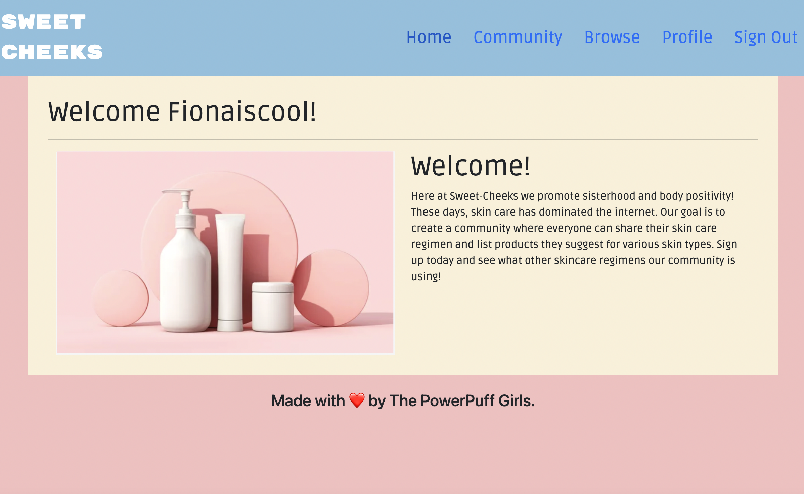

# SWEET CHEEKS

## Description

Our skin is the largest organ in the body, protecting us from outside elements. Healthy skin can improve confidence, mood, and appearance. Many people who are interested in getting into skincare don’t know where to start. Each person’s skin varies in skin type- from oily to dry to combination skin. There’s also many other different factors to consider such as discoloration, scarring, rosacea, sensitive skin, etc. Many skin care lovers would love an app where finding the right product is simplified. Our app consists of a community of skincare lovers that post reviews of the best skincare products out there. Each member of our community has a detailed profile where other users can view and read about their skincare regimens. Targeting all skin types, we add value by simplifying the process of finding the right products after reviewing those with similar skin concerns and the products they used to solve their issues.

## Installation

The npm install script: Installs all dependencies for root as wells as client and server.
npm run develop script: Uses concurrently to run the back-end with nodemon and launches the create-react-app development server for front-end development.

## Usage

   

## Credits

Deployed application:
GitHub: https://github.com/cpolland/sweet-cheeks

Collaborators:
Cody Polland, https://github.com/cpolland
Lily Namou, https://github.com/lilynamou
Mariana Tapia, https://github.com/magiscoding2113
Fiona Carroll, https://github.com/fcarroll12

## License

The last section of a high-quality README file is the license. This lets other developers know what they can and cannot do with your project. If you need help choosing a license, refer to [https://choosealicense.com/](https://choosealicense.com/).

---
